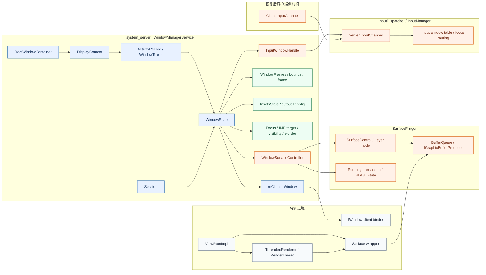

# WMS 重连

## WMS 需要恢复的状态

- 蓝色：可以“逻辑恢复/找回身份”的对象
- 橙色：通常要**“重建”**的对象
- 绿色：恢复后要“重新计算/重新下发”的状态



可以把它读成这样：

- 先找回蓝色主干：RootWindowContainer -> DisplayContent -> ActivityRecord/WindowToken -> WindowState -> Session/mClient
- 再重建橙色资源：输入通道、输入窗口表、SurfaceControl/Layer、BufferQueue
- 最后重新计算绿色状态：frame/bounds、InsetsState、焦点、IME target、可见性、z-order
- App 侧再用新的 Surface 和 InputChannel 继续跑 ViewRootImpl/ThreadedRenderer

一个关键点是：fd 只在橙色区域里占很小一部分，主要是 InputChannel 这一支。真正麻烦的是：

- Binder 身份关系：IWindow、Session、WindowState.mClient
- WMS 内部注册表和层级关系：窗口属于谁、挂在哪个 DisplayContent 下、z-order/focus 是什么——焦点、z-order、可见性是**全局竞争结果**，不是单个 app 能单方面恢复的。
- SurfaceFlinger / InputDispatcher 那边的对象图和注册状态——InputChannel 包含 **InputDispatcher 里的连接对象、epoll 注册、焦点路由、事件队列**；BufferQueue 中的部分状态**和 GPU/驱动/HWC 强绑定**
- 几何与策略状态：frame、Insets、IME/focus/visibility——它们依赖当前 display rotation、cutout、状态栏/导航栏、IME、锁屏、多窗口、其他窗口遮挡情况，需要**重算**

### WMS 内部注册表和层级关系

简化结构大概是这样：

```
RootWindowContainer
  DisplayContent[displayId]
    DisplayArea / Task / ActivityRecord
      WindowToken
        WindowState
          child windows...

并行维护的注册表/状态：
  mWindowMap
  mCurrentFocus
  mFocusedApp
  z-order / layer assignment
  visible windows
  IME target
```

这部分本质上是“WMS 对窗口世界的权威视图”：

- 窗口挂在哪个 DisplayContent
- 属于哪个 ActivityRecord / WindowToken
- 谁在前面，谁被遮挡
- 当前焦点是谁，IME 应该跟谁走

**这部分为什么不适合“从 app 快照里硬恢复”：**

- 权威状态在 WMS，不在 app。
- app 并不知道完整窗口树，也不知道别的 app / 系统窗口现在的状态。
- **焦点、z-order、可见性是<u>全局竞争结果</u>，不是单个 app 能单方面恢复的。**


### SurfaceFlinger / InputDispatcher 的对象图

这是最该重建的一块。

Surface 侧简化结构：

```
WindowState
  -> WindowSurfaceController
  -> SurfaceControl
  -> SurfaceFlinger::Layer
  -> BufferQueueCore
  -> IGraphicBufferProducer
  -> app Surface / ANativeWindow / HWUI
```

Input 侧简化结构：

```
WindowState
  -> InputWindowHandle
  -> InputDispatcher Connection(server side)
  -> InputChannel(server fd) <-> InputChannel(client fd)
  -> InputEventReceiver / Looper
```

为什么这部分不能只做逻辑恢复：

- 它们是跨进程对象图，不只是一块 Java/C++ 内存。
- SurfaceControl 背后是 SurfaceFlinger 里的 Layer；Surface 背后是 BufferQueue producer。
- InputChannel 不只是 fd，还包含 **InputDispatcher 里的连接对象、epoll 注册、焦点路由、事件队列**。
- BufferQueue 里还有 slot、generation、fence、gralloc buffer 生命周期；**这些状态和 GPU/驱动/HWC 强绑定**。
- 恢复 app 时，这些远端对象没有一起回滚到同一时刻，快照中的句柄和远端当前状态很容易已经不一致。

所以这里最稳妥的恢复方式就是：

- 新建 InputChannel pair，重新注册到 InputDispatcher
- 销毁旧 SurfaceControl/Layer
- 新建新的 SurfaceControl + BufferQueue
- 让 app 拿新 Surface 重新画第一帧


## 应用初始化 WMS 阶段拆解和权衡

要具体确定在哪个节点进行 CRIU dump，首先需要明确应用初始化 WMS 的各个阶段。

`Activity.onResume()` 返回到“首帧真正显示”之间，可以拆成 5 个有意义的阶段。关注点在“窗口链路已经建到哪一步了”。一旦跨过某个点，恢复时就必须补上 WMS/Surface/Input/HWUI 的那部分硬成本。

| 阶段                                                         | 大致时机                                                     | 主要在干什么                                                 | 这时 snapshot/restore 的恢复成本                             | 性价比 |
| :----------------------------------------------------------- | :----------------------------------------------------------- | :----------------------------------------------------------- | :----------------------------------------------------------- | :----- |
| 1. onResume() 回调执行中/刚返回                              | performResumeActivity() 内                                   | app 恢复业务状态、注册监听、可能启动异步加载/动画            | 最低。窗口还没真正 attach 到 WMS，通常可避开 reconnectWindow 主成本 | 很高   |
| 2. handleResumeActivity() 继续往下，准备 makeVisible/addView | onResume 已结束，但顶层窗口还没正式进入首轮 relayout         | DecorView 已有，Activity 逻辑已稳定，马上要把窗口交给 WMS    | 很低到低。还能尽量避开 Surface/Input 重建                    | 最高   |
| 3. WindowManager.addView / ViewRootImpl.setView 刚开始       | ViewRoot 建立，输入阶段初始化，开始 requestLayout/scheduleTraversals | app 侧窗口根已经成形，但 WMS 侧资源可能还没完全建好          | 低到中。比阶段 2 稍贵，但仍有机会避开最重的首帧渲染成本      | 高     |
| 4. 首次 relayoutWindow 返回后，已有 SurfaceControl/InputChannel/frame/insets | WMS 已为窗口建了 layer、BufferQueue、输入通道                | 这时窗口系统资源已经落地，恢复时通常要走完整 reconnectWindow | 中到高                                                       | 一般   |
| 5. 首次 performTraversals/draw 已开始，RenderThread/HWUI 已绑 surface，但首帧尚未 present | UI 线程 measure/layout/draw，RenderThread 建管线并提交 buffer，等待 SF 合成 | 最高。你已经把最重的图形链路建了一遍，恢复还得重建或重绑     | 低                                                           |        |

每个阶段具体会发生什么？

### 1. onResume() 回调阶段

这一段主要是 app 业务逻辑恢复，不是窗口系统恢复。常见内容有：

- 恢复 ViewModel/Presenter/UI state
- 注册传感器、广播、定位、相机等监听
- 启动异步数据加载
- 准备首页骨架数据、placeholder、adapter 初值
- 某些页面开始准备转场、动画、预取

这一段的特点是：
Activity 逻辑状态已经开始稳定，但系统级窗口对象还没真正“活起来”。如果恢复点落在这里，恢复后基本可以直接重新走正常首帧，不需要先修一堆坏掉的 surface/buffer/input 资源。

问题在于：
太早。你保住了进程和业务对象状态，但几乎没保住任何“窗口已就绪”的东西。

### 2. onResume() 返回后，到 makeVisible/addView 前

这是我认为最值得关注的甜点区。此时通常具备这些特征：

- onCreate/onStart/onResume 都跑完了

- 首页骨架所需的业务状态大多已齐

- DecorView、内容 View 层级通常已经存在

- 但窗口还没真正发起第一轮 relayout 去申请 surface / input channel


此时：“应用逻辑已经 ready，窗口资源还没变重。”

这时候 snapshot/restore 的好处最大：

- 保住了 Activity 已恢复完成的业务状态

- 还没支付 SurfaceControl/BufferQueue/InputChannel/HWUI 的大头成本

-  恢复后基本像一次“继续正常显示首页”的 warm resume

### 3. ad dView/setView 之后，但首次 relayoutWindow 之前或刚启动 traversal

这里已经开始建立 ViewRootImpl，但还没彻底把窗口资源都建完。典型动作有：

- 建 ViewRootImpl
- 初始化输入阶段、Choreographer、sync pipeline
- requestLayout()
- scheduleTraversals()

这时 app 侧“窗口根”已经完整，系统侧重资源可能还没完全落地。它比阶段 2 多保住一点“UI attach 上下文”，但复杂度也上来了。

这是一个次优但也很实用的点：
如果你们很难在 handleResumeActivity -> makeVisible 之间卡住，卡在这里也仍然不错。前提是别让它继续推进到首次成功 relayoutWindow。

### 4. 首次 relayoutWindow 成功返回后

一旦走到这里，事情就变了。通常已经发生：

- WMS 为窗口建立或确认 WindowState
- 创建 SurfaceControl
- 建立/返回 InputChannel
- 准备 BufferQueue
- 下发 frame、insets、可见性等窗口参数

这正好踩到你们文档里恢复最贵的那段：PLAN-OTHER-STATES.md (line 333) 到 PLAN-OTHER-STATES.md (line 364)。

如果在这里 snapshot，restore 后你很大概率要补：

- IWindow 替换
- InputChannel 重建和重新注册
- SurfaceControl/layer/BufferQueue 重建
- 再次同步 input windows

所以它虽然还没“显示首帧”，但系统资源其实已经很重了。对恢复耗时并不友好。

### 5. draw 已开始、首帧还没 present

这是“最不划算的首帧前点”。此时一般已经在做：

- UI 线程 measure/layout/draw
- ThreadedRenderer/RenderThread 绑定 surface
- 创建或恢复 EGL/Vulkan 相关图形状态
- 首个 buffer 入队
- 等待 SurfaceFlinger 合成和显示

这时你既已经付出了首帧构建成本，又还没真正把结果给用户看到。restore 后通常还要重新绑 ThreadedRenderer.setSurface(null) -> setSurface(newSurface)，也就是你们文档里 app 侧最贵那段 PLAN-OTHER-STATES.md (line 373) 到 PLAN-OTHER-STATES.md (line 373)。

除非你特别需要“冻结在马上出图的那一瞬间”，否则不建议选这里。

### 哪个阶段性价比最高

如果只看“恢复速度”，最佳是：

1. 阶段 2：onResume 已完成，但 addView/relayout 尚未真正开始
2. 阶段 3：setView 初期，但还没拿到首个有效 SurfaceControl/InputChannel

原因很直接：

- 业务状态已经稳定，不用太早冻结
- 还没进入 WMS/Surface/HWUI 的重资源区
- 恢复后更像继续正常首帧启动，而不是“修一条断掉的图形链路”

如果看“既要快，又希望页面骨架尽量现成”，我会优先推荐：

- 最优点：onResume 结束后，首页骨架数据 ready，但在 WindowManager.addView 前
- 次优点：ViewRootImpl.setView 之后、首次成功 relayoutWindow 之前

如果你追求“尽可能保住更多窗口状态”，才考虑阶段 4；但它的恢复代价会明显上去。阶段 5 基本不建议，除非实验目标就是研究最晚恢复点。

**一个实用判断标准**

你们可以用一句话判断恢复点是否划算：

- 还没拿到有效 SurfaceControl/InputChannel：通常划算
- 已经拿到它们，但首帧还没 show：通常不划算

因为一旦拿到了，就等于你已经进入了恢复最贵的那段系统资源区；虽然还没显示，但成本已经发生了。