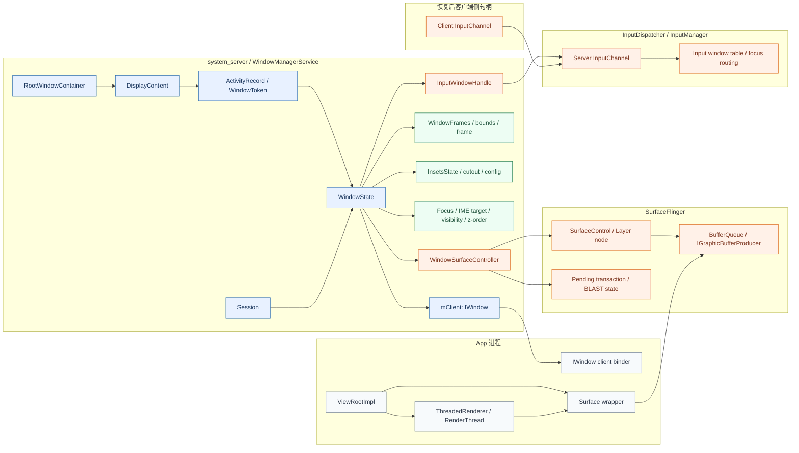

# WMS 维护的状态



# 橙色组件详细说明

## 1. **IWH - InputWindowHandle**

### 功能
- 输入系统中代表一个窗口的句柄对象
- 包含窗口的输入相关属性（触摸区域、输入特性、z-order等）

### 具体内容
```cpp
struct InputWindowHandle {
    sp<InputChannel> inputChannel;  // 关联的输入通道
    Rect touchableRegion;            // 可触摸区域
    int32_t layoutParamsFlags;       // 窗口标志
    int32_t layoutParamsType;        // 窗口类型
    nsecs_t dispatchingTimeout;      // 分发超时
    int32_t ownerPid, ownerUid;      // 所属进程信息
}
```

### 为什么需要重建
- 窗口属性变化时需要更新
- 与 InputChannel 的关联需要重新建立

---

## 2. **WSC - WindowSurfaceController**

### 功能
- WMS 中管理 Surface 的控制器
- 连接 WindowState 和 SurfaceFlinger 的 SurfaceControl

### 具体内容
```java
class WindowSurfaceController {
    SurfaceControl mSurfaceControl;        // SF 中的 Layer
    SurfaceControl.Transaction mTrans;     // 待提交的事务
    
    void setPosition(float x, float y);    // 设置位置
    void setSize(int w, int h);            // 设置大小
    void setLayer(int layer);              // 设置 z-order
    void hide/show();                      // 显示/隐藏
}
```

### 为什么需要重建
- SurfaceControl 是 native 对象，进程重启后失效
- 需要重新向 SurfaceFlinger 注册 Layer

---

## 3. **ICS - Server InputChannel (服务端输入通道)**

### 功能
- InputDispatcher 持有的输入通道服务端
- 负责向客户端发送输入事件

### 具体内容
```cpp
class InputChannel {
    int fd;                    // Socket 文件描述符
    std::string name;          // 通道名称
    
    status_t sendMessage();    // 发送事件
    status_t receiveMessage(); // 接收响应
}
```

### 数据流
```
InputDispatcher → ICS (server fd) 
                    ↓ socket pair
                  ICC (client fd) → App's InputEventReceiver
```

### 为什么需要重建
- Socket fd 在进程重启后失效
- 需要重新创建 socketpair 并传递给客户端

---

## 4. **ITable - Input window table / focus routing**

### 功能
- InputDispatcher 维护的窗口查找表
- 用于输入事件的路由和焦点管理

### 具体内容
```cpp
class InputDispatcher {
    std::unordered_map<int32_t, sp<InputWindowHandle>> 
        mWindowHandlesByDisplay;           // 按 display 索引窗口
    
    sp<InputWindowHandle> mFocusedWindow;  // 当前焦点窗口
    std::vector<sp<InputWindowHandle>> 
        mTouchStatesByDisplay;             // 触摸状态追踪
    
    // 路由逻辑
    findTouchedWindowAtLocked();
    dispatchKeyLocked();
}
```

### 为什么需要重建
- 窗口列表变化时需要更新
- 焦点状态需要与 WMS 同步

---

## 5. **SC - SurfaceControl / Layer node**

### 功能
- SurfaceFlinger 中的图层节点
- 客户端通过它控制 Layer 的属性

### 具体内容
```cpp
class SurfaceControl {
    sp<SurfaceComposerClient> mClient;  // 连接到 SF 的客户端
    sp<IBinder> mHandle;                // Layer 的 Binder 句柄
    
    // 事务操作（通过 Transaction 提交）
    setPosition(x, y);
    setSize(w, h);
    setLayer(z);
    setAlpha(alpha);
    setCrop(rect);
    setBuffer(buffer);
}
```

### Layer 树结构
```
DisplayContent (root)
  └─ ActivityRecord Layer
      └─ WindowState Layer (SC)
          └─ SurfaceView Layer
```

### 为什么需要重建
- Layer 是 SurfaceFlinger 的 native 对象
- 客户端重启后需要重新创建并关联

---

## 6. **BQ - BufferQueue / IGraphicBufferProducer**

### 功能
- 生产者-消费者模式的图形缓冲区队列
- App 生产帧，SurfaceFlinger 消费帧

### 具体内容
```cpp
class BufferQueue {
    // 生产者接口（App 侧）
    IGraphicBufferProducer:
        dequeueBuffer()   // 获取空闲 buffer
        queueBuffer()     // 提交渲染完成的 buffer
        
    // 消费者接口（SF 侧）
    IGraphicBufferConsumer:
        acquireBuffer()   // 获取待合成的 buffer
        releaseBuffer()   // 释放已合成的 buffer
}
```

### 数据流
```
App RenderThread → dequeueBuffer() → GPU 渲染 
                → queueBuffer() 
                → SF acquireBuffer() → 合成显示
```

### 为什么需要重建
- 包含共享内存和 Binder 引用
- 进程重启后需要重新建立生产者-消费者连接

---

## 7. **TX - Pending transaction / BLAST state**

### 功能
- 待提交的 SurfaceFlinger 事务
- BLAST (Buffer as LayerState) 同步机制状态

### 具体内容
```cpp
class Transaction {
    std::vector<ComposerState> mComposerStates;  // Layer 状态变更
    std::vector<DisplayState> mDisplayStates;    // Display 状态变更
    
    // 操作
    setPosition(sc, x, y);
    setBuffer(sc, buffer, fence);
    setVisibility(sc, visible);
    
    // 提交
    apply();              // 立即应用
    merge(other);         // 合并事务
}
```

### BLAST 同步
```java
// 客户端侧
BLASTBufferQueue {
    Transaction mTransaction;
    long mTransactionId;
    
    // 同步帧提交和属性变更
    syncNextTransaction(parentSyncId);
}
```

### 为什么需要重建
- 事务状态依赖当前的 Layer 引用
- 同步状态需要与新的客户端重新建立

---

## 8. **ICC - Client InputChannel (客户端输入通道)**

### 功能
- App 进程中持有的输入通道客户端
- 接收来自 InputDispatcher 的输入事件

### 具体内容
```java
// Java 侧
class InputChannel {
    private long mPtr;  // Native InputChannel 指针
    
    // 通过 Parcel 传递
    public void writeToParcel(Parcel out);
    public void readFromParcel(Parcel in);
}

// Native 侧
ViewRootImpl {
    InputEventReceiver mInputEventReceiver;
    
    // 监听 fd 可读事件
    onInputEvent(InputEvent event) {
        deliverInputEvent(event);  // 分发到 View 树
    }
}
```

### 创建流程
```
WMS.addWindow() 
  → InputChannel.openInputChannelPair()  // 创建 socketpair
  → 服务端 fd 注册到 InputDispatcher
  → 客户端 fd 通过 Binder 传回 App
  → ViewRootImpl 监听客户端 fd
```

### 为什么需要重建
- Socket fd 不能跨进程持久化
- App 重启后需要重新获取并注册到 Looper

---

## 🎯 总结：橙色组件的共性

| 特性         | 说明                              |
| ------------ | --------------------------------- |
| **本质**     | 跨进程通信的底层资源句柄          |
| **依赖**     | 文件描述符、Binder 引用、共享内存 |
| **生命周期** | 与进程绑定，无法持久化            |
| **恢复方式** | 必须通过系统服务重新创建和分发    |
| **关键路径** | 输入事件传递、图形缓冲区传递      |

这些组件是 Android 窗口系统中最底层、最关键的"管道"，确保了输入和渲染的实时性能。
