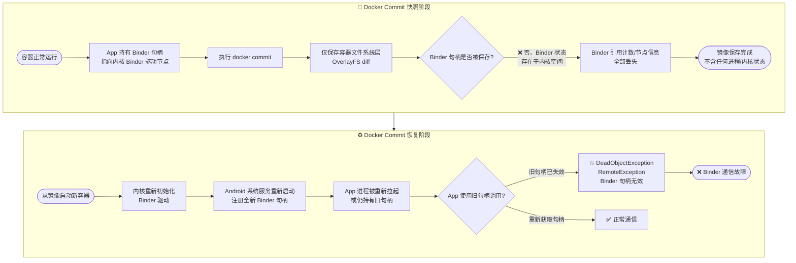
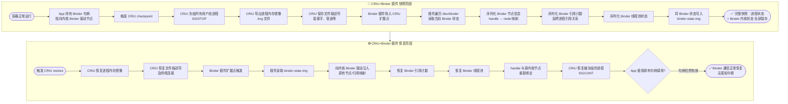
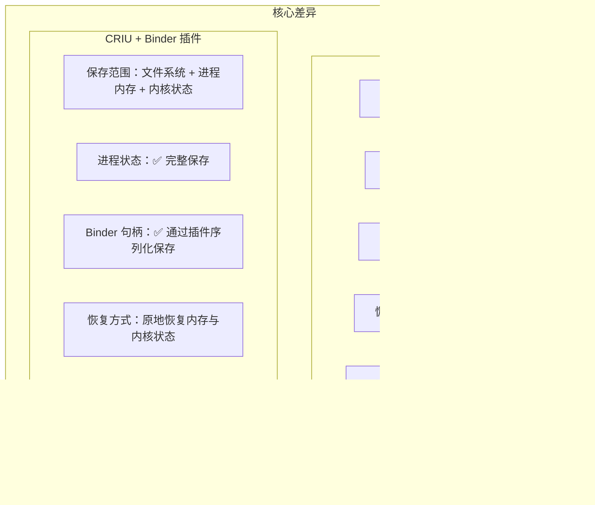
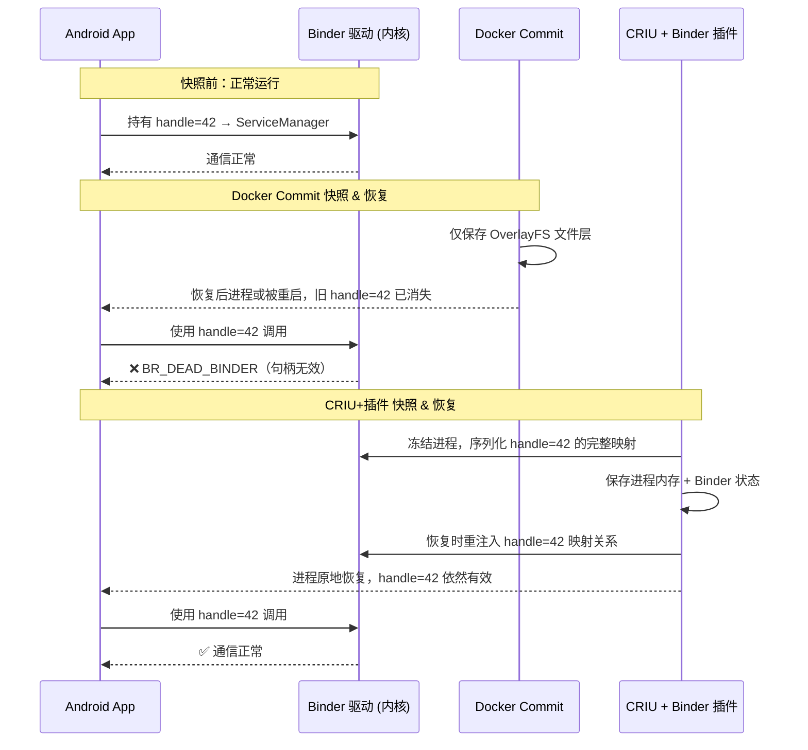

# 快照方案流程对比：Docker Commit vs CRIU+Binder 插件

## 1. Docker Commit 快照流程

```mermaid
flowchart TD
    subgraph DC_SNAP["📸 Docker Commit 快照阶段"]
        A1([容器正常运行]) --> B1[App 持有 Binder 句柄\n指向内核 Binder 驱动节点]
        B1 --> C1[执行 docker commit]
        C1 --> D1[仅保存容器文件系统层\nOverlayFS diff]
        D1 --> E1{Binder 句柄是否被保存?}
        E1 -- ❌ 否，Binder 状态\n存在于内核空间 --> F1[Binder 引用计数/节点信息\n全部丢失]
        F1 --> G1([镜像保存完成\n不含任何进程/内核状态])
    end

    subgraph DC_REST["♻️ Docker Commit 恢复阶段"]
        H1([从镜像启动新容器]) --> I1[内核重新初始化\nBinder 驱动]
        I1 --> J1[Android 系统服务重新启动\n注册全新 Binder 句柄]
        J1 --> K1[App 进程被重新拉起\n或仍持有旧句柄]
        K1 --> L1{App 使用旧句柄调用?}
        L1 -- 旧句柄已失效 --> M1[💥 DeadObjectException\nRemoteException\nBinder 句柄无效]
        L1 -- 重新获取句柄 --> N1[✅ 正常通信]
        M1 --> O1([❌ Binder 通信故障])
    end

    DC_SNAP --> DC_REST
```

---

## 2. CRIU + Binder 插件快照流程

```mermaid
flowchart TD
    subgraph CR_SNAP["📸 CRIU+Binder 插件 快照阶段"]
        A2([容器正常运行]) --> B2[App 持有 Binder 句柄\n指向内核 Binder 驱动节点]
        B2 --> C2[触发 CRIU checkpoint]

        C2 --> P1[CRIU 冻结所有用户态进程\nSIGSTOP]
        P1 --> P2[CRIU 导出进程内存镜像\n.img 文件]
        P2 --> P3[CRIU 保存文件描述符\n套接字、管道等]
        P3 --> P4[Binder 插件钩入 CRIU\n扩展点]

        P4 --> Q1[插件遍历 /dev/binder\n读取当前 Binder 状态]
        Q1 --> Q2[序列化 Binder 节点信息\nhandle → node 映射]
        Q2 --> Q3[序列化 Binder 引用计数\n及跨进程引用关系]
        Q3 --> Q4[序列化 Binder 线程池状态]
        Q4 --> Q5[将 Binder 状态写入\nbinder-state.img]

        Q5 --> R1([✅ 完整快照：进程状态\n+ Binder 内核状态 全部保存])
    end

    subgraph CR_REST["♻️ CRIU+Binder 插件 恢复阶段"]
        S1([触发 CRIU restore]) --> T1[CRIU 恢复进程内存镜像]
        T1 --> T2[CRIU 恢复文件描述符\n及网络连接]
        T2 --> T3[Binder 插件扩展点触发]

        T3 --> U1[插件读取 binder-state.img]
        U1 --> U2[向内核 Binder 驱动注入\n原有节点/引用映射]
        U2 --> U3[恢复 Binder 引用计数]
        U3 --> U4[恢复 Binder 线程池]
        U4 --> U5[handle 与原内核节点\n重新绑定]

        U5 --> V1[CRIU 恢复被冻结的进程\nSIGCONT]
        V1 --> W1{App 使用原有句柄调用?}
        W1 -- 句柄仍然有效 --> X1([✅ Binder 通信正常恢复\n无感知中断])
    end

    CR_SNAP --> CR_REST
```

---

## 3. 两种方案核心差异对比

```mermaid
flowchart LR
    subgraph KEY["核心差异"]
        direction TB

        subgraph DC["Docker Commit"]
            dc1["保存范围：文件系统层"]
            dc2["进程状态：❌ 不保存"]
            dc3["Binder 句柄：❌ 不保存"]
            dc4["恢复方式：重新启动容器"]
            dc5["Binder 结果：❌ 句柄全部失效"]
        end

        subgraph CR["CRIU + Binder 插件"]
            cr1["保存范围：文件系统 + 进程内存 + 内核状态"]
            cr2["进程状态：✅ 完整保存"]
            cr3["Binder 句柄：✅ 通过插件序列化保存"]
            cr4["恢复方式：原地恢复内存与内核状态"]
            cr5["Binder 结果：✅ 句柄恢复有效"]
        end
    end
```

---

## 4. 故障根因说明

```mermaid
sequenceDiagram
    participant App as Android App
    participant Binder as Binder 驱动 (内核)
    participant DockerCommit as Docker Commit
    participant CRIU as CRIU + Binder 插件

    Note over App,Binder: 快照前：正常运行
    App->>Binder: 持有 handle=42 → ServiceManager
    Binder-->>App: 通信正常

    Note over App,DockerCommit: Docker Commit 快照 & 恢复
    DockerCommit->>DockerCommit: 仅保存 OverlayFS 文件层
    DockerCommit-->>App: 恢复后进程或被重启，旧 handle=42 已消失
    App->>Binder: 使用 handle=42 调用
    Binder-->>App: ❌ BR_DEAD_BINDER（句柄无效）

    Note over App,CRIU: CRIU+插件 快照 & 恢复
    CRIU->>Binder: 冻结进程，序列化 handle=42 的完整映射
    CRIU->>CRIU: 保存进程内存 + Binder 状态
    CRIU->>Binder: 恢复时重注入 handle=42 映射关系
    CRIU-->>App: 进程原地恢复，handle=42 依然有效
    App->>Binder: 使用 handle=42 调用
    Binder-->>App: ✅ 通信正常
```
