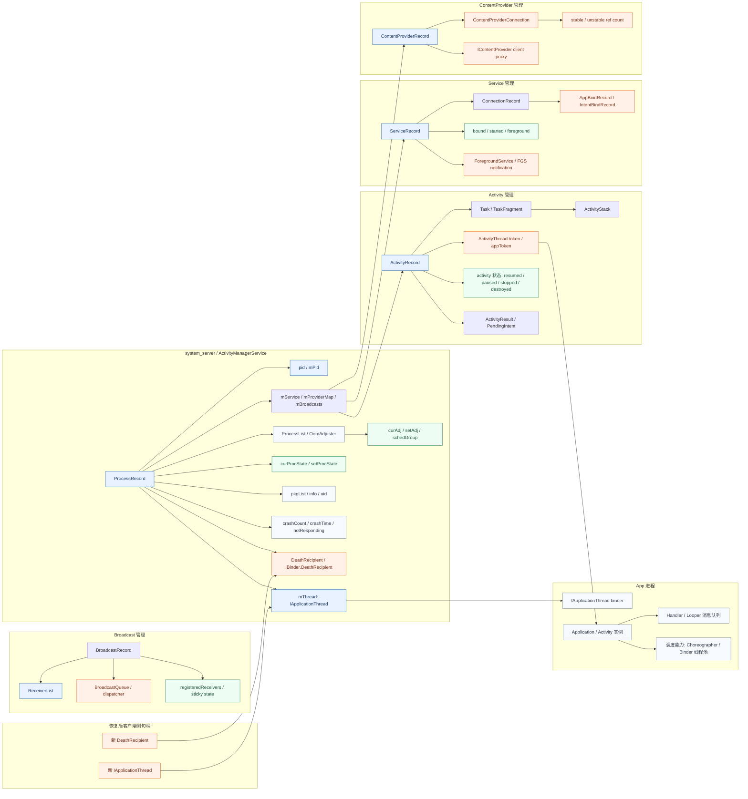

# AMS 重连

## AMS 需要恢复的状态

- 蓝色：可以"逻辑恢复/找回身份"的对象
- 橙色：通常要**"重建"**的对象
- 绿色：恢复后要"重新计算/重新同步"的状态



可以把它读成这样：

- 先找回蓝色主干：ProcessRecord → pid/mThread → ActivityRecord/ServiceRecord/ContentProviderRecord → 它们的层级归属
- 再重建橙色资源：DeathRecipient、ActivityThread token、Service 绑定关系、ContentProvider 连接和引用计数、Broadcast dispatcher 注册、FGS 通知
- 最后重新计算绿色状态：adj/procState/调度组、Activity 生命周期状态、Service started/bound/foreground 状态、sticky broadcast 和已注册 receiver 的有效期
- App 侧再用新的 IApplicationThread 和 DeathRecipient 重新接入 AMS 的回调体系

一个关键点是：Binder fd（IApplicationThread）只是橙色区域的一部分。真正麻烦的是：

- **进程身份关系**：ProcessRecord 通过 pid + IApplicationThread 识别 app 进程，restore 后 pid 变化或 IApplicationThread Binder 失效都意味着 AMS 认为进程已死
- **AMS 内部注册表和生命周期管理**：Activity 属于哪个 Task、Service 是否在运行、Provider 引用计数、Broadcast receiver 注册——这些是**AMS 对进程世界的权威视图**，不是 app 能单方面恢复的
- **四大组件的状态机**：ActivityRecord/ServiceRecord/ContentProviderRecord/BroadcastRecord 各自维护了严格的**生命周期状态机**，状态转换有前置条件和副作用（如 FGS notification、adj 变化、ANR 超时），不能随意跳转
- **进程调度与 OOM 策略**：curAdj/curProcState/schedGroup 是**全局竞争结果**，依赖所有进程的当前状态，不是单个 app 能单方面恢复的 [参考](#AMS 内部注册表和进程管理)

### AMS 内部注册表和进程管理

简化结构大概是这样：

```
ActivityManagerService
  mProcessList
    mPidsSelfLocked: SparseArray<ProcessRecord>    # pid → ProcessRecord
    mProcessNames: ProcessMap<ProcessRecord>        # (name,uid) → ProcessRecord
    mActiveUids: ActiveUids                         # uid → UidRecord

  mOomAdjuster
    adj 级别计算: curAdj, setAdj
    procState 计算: curProcState, setProcState
    schedGroup 计算: curSchedGroup, setSchedGroup

  mActivityTaskManager (ATMS)
    RootWindowContainer
      DisplayContent
        Task
          ActivityRecord  (appToken, intent, state)

  mServices: ActiveServices
    mServiceMap: ServiceMap                 # (name,uid) → ServiceRecord
    mServiceConnections: ConnectionRecord[]
    mForegroundServices: FGS 跟踪

  mBroadcastQueue
    mParallelBroadcasts / mOrderedBroadcasts
    mRegisteredReceivers: HashMap<IBinder, ReceiverList>

  mProviderMap
    mProvidersByName: ProviderMap           # name → ContentProviderRecord
    mProvidersByClass: ProviderMap          # class → ContentProviderRecord
    mProviderConnections: ContentProviderConnection[]
```

这部分本质上是"AMS 对进程和组件世界的权威视图"：

- 哪个 pid 对应哪个 ProcessRecord
- 进程当前优先级和调度组是什么
- 哪些 Activity 正在运行，处于什么生命周期状态
- 哪些 Service 在运行，谁 bind 了它们
- 哪些 Provider 被谁引用，引用计数是多少
- 哪些 Broadcast receiver 注册了，谁还没处理完

**这部分为什么不适合"从 app 快照里硬恢复"：**

- 权威状态在 AMS，不在 app。
- app 并不知道别的 app / 系统进程当前的组件状态。
- **adj/procState/调度组是<u>全局竞争结果</u>，不是单个 app 能单方面恢复的。**
- **组件生命周期状态机有严格的转换约束**，不能随便跳到一个状态而不触发它的副作用。

### 四大组件的对象图

这是恢复时需要逐个处理的核心。

Activity 侧简化结构：

```
ProcessRecord
  -> ActivityRecord (通过 appToken / app 进程关联)
     -> Task / TaskFragment
     -> ActivityStack
     -> appToken: IBinder (在 app 进程里对应 Activity.mToken)
     -> mActivityThread: IApplicationThread (回调通道)
     -> state: RESUMED / PAUSED / STOPPING / STOPPED / ...
     -> ActivityResult / PendingIntent
     -> Configuration / overrideConfig
```

Service 侧简化结构：

```
ProcessRecord
  -> ServiceRecord (通过 processName + uid 关联)
     -> AppBindRecord (谁 bind 了它)
        -> ConnectionRecord[] (每个 ConnectionRecord 对应一个客户端连接)
           -> IServiceConnection (客户端回调 Binder)
     -> IntentBindRecord[] (Intent → 绑定映射)
     -> started / bound / foreground 状态标志
     -> ForegroundService notification

ActiveServices 还维护:
  -> mPendingServices (等待启动的 Service)
  -> mRestartingServices (等待重启的 Service)
  -> mDestroyingServices (等待销毁的 Service)
```

Provider 侧简化结构：

```
ProcessRecord
  -> ContentProviderRecord (通过 processName + uid 关联)
     -> ContentProviderConnection[] (谁连了它)
        -> client → ProcessRecord (引用进程)
        -> stable / unstable ref count
        -> IContentProvider (客户端代理 Binder)
     -> mProviders (进程内 ContentProvider 实例引用)

mProviderMap 还维护:
  -> 全局 name → CPR 映射
  -> 全局 class → CPR 映射
```

Broadcast 侧简化结构：

```
ProcessRecord
  -> ReceiverList (通过 IBinder key 注册)
     -> receiver: IIntentReceiver (app 侧回调 Binder)
     -> filter[]: BroadcastFilter
     -> registeredReceivers 映射

mBroadcastQueue 还维护:
  -> mParallelBroadcasts (并行广播队列)
  -> mOrderedBroadcasts (有序广播队列)
  -> sticky broadcasts (按 action 缓存)
```

为什么这些组件状态不能只做逻辑恢复：

- **ActivityRecord.state 是有限状态机**。如果 restore 后 app 侧 Activity 实例认为自己是 RESUMED，但 AMS 侧 ActivityRecord 可能已被推进到 STOPPED 或 DESTROYED，这种不一致会导致后续生命周期回调错误。
- **Service 的 started/bound/foreground 三维状态**。一个 Service 可能同时 started + bound + foreground。FGS 有 notification 和超时约束，不能简单地"假装还在前台"。
- **ContentProviderConnection 的引用计数**。stable 和 unstable ref count 必须精确匹配。如果漂移，会导致 Provider 过早被 kill 或永远不被释放。
- **BroadcastReceiver 注册**。注册的 IIntentReceiver 是一个 Binder 回调，如果 Binder 失效，AMS 永远无法投递广播给 app。

所以这里最稳妥的恢复方式是：

- 让 AMS 显式知道该进程经历了 checkpoint/restore
- 重建 IApplicationThread 通道
- 按 ProcessRecord 现存状态重新对齐四大组件
- 对无法安全恢复的组件走 fallback（如 Service restart、Activity recreate）

### ProcessRecord 关键字段与 CRIU 影响

以下分析基于 AOSP `ProcessRecord.java` (Android 12 / main branch)。

#### Binder 引用型字段（restore 后必定失效）

| 字段 | 行号 | 类型 | 失效后果 |
|:-----|:-----|:-----|:---------|
| `mThread` | L154 | `ApplicationThreadDeferred` | AMS → app 的所有回调不可达，包括生命周期、service 启停、broadcast 投递 |
| `mOnewayThread` | L162 | `IApplicationThread` | oneway 调用通道断裂 |
| `mPid` | L124 | `int` | `mPidsSelfLocked` 索引失效，AMS 找不到该进程 |
| `mDeathRecipient` | L273 | `IBinder.DeathRecipient` | 旧 Binder 代理死亡时触发 `binderDied()` → `appDiedLocked()` 级联清理 |
| `mRenderThreadTid` | L249 | `int` | HWUI 渲染线程 TID 变化，影响 vsync 和优先级继承 |
| `mDyingPid` | L130 | `int` | 进程死亡跟踪混乱 |

#### 四大子记录

ProcessRecord 委托给四个子记录管理组件状态：

```java
final ProcessServiceRecord mServices;       // L391 — 进程内所有 Service
final ProcessProviderRecord mProviders;     // L396 — 进程内所有 Provider
final ProcessReceiverRecord mReceivers;     // L401 — 进程内所有 Receiver
final ProcessErrorStateRecord mErrorState;  // L406 — crash/ANR 状态
ProcessStateRecord mState;                  // L411 — procState, oom adj
final ProcessCachedOptimizerRecord mOptRecord; // L416 — freezer 状态
```

每个子记录内部也持有 Binder 引用：

- `ProcessServiceRecord.mServices`: `ArraySet<ServiceRecord>` — 每个 ServiceRecord 持有 `binder` (IBinder) 和 `connections` (ConnectionRecord[])
- `ProcessProviderRecord.mPubProviders`: `ArrayMap<String, ContentProviderRecord>` — 每个 CPR 持有 `IContentProvider` 代理
- `ProcessProviderRecord.mConProviders`: `ArrayList<ContentProviderConnection>` — 每个 CPC 持有 stable/unstable ref count
- `ProcessReceiverRecord` 中的 `ReceiverList` — key 是 `IIntentReceiver` Binder

#### makeActive / makeInactive — 进程注册机制

`makeActive` 是 AMS 在 `attachApplicationLocked` 中注册进程的核心方法：

```java
// ProcessRecord.java L742-L765
public void makeActive(ApplicationThreadDeferred thread, ProcessStatsService tracker) {
    mThread = thread;                                    // 设置 Binder 通道
    mOnewayThread = mThread;                             // oneway 通道
    mWindowProcessController.setThread(mThread);         // 同步到 WPC
    // ...
}

public void makeInactive(ProcessStatsService tracker) {
    mThread = null;                                      // 清除 Binder 通道
    mOnewayThread = null;
    mWindowProcessController.setThread(null);
    // ...
}
```

**CRIU 恢复后必须重新调用 `makeActive`**，用新的 `IApplicationThread` 替换旧的。

### AppDeathRecipient 级联 — 最危险的恢复陷阱

AMS 通过 `AppDeathRecipient` 监听进程死亡：

```java
// AMS.java L1502-L1526
private final class AppDeathRecipient implements IBinder.DeathRecipient {
    final ProcessRecord mApp;
    final int mPid;
    final IApplicationThread mAppThread;

    @Override
    public void binderDied() {
        synchronized(ActivityManagerService.this) {
            appDiedLocked(mApp, mPid, mAppThread, true, null);
        }
    }
}
```

**级联路径**：旧 IApplicationThread Binder 代理死亡 → `binderDied()` → `appDiedLocked()` → `handleAppDiedLocked()` → `cleanUpApplicationRecordLocked()`

`cleanUpApplicationRecordLocked` 是**最危险的函数**，它会：

1. 从 LRU 列表和 `mPidsSelfLocked` 中移除进程
2. 调用 `makeInactive` 清除 `mThread`
3. 清理所有 broadcast 注册
4. **Kill 所有 Service**（`mServices.killServicesLocked`）
5. 从 `mProcessNames` 中移除进程名
6. 通知 ATMS 清理 Activity
7. 如果需要重启，走 zygote 重新 fork

**如果 CRIU restore 后不先处理 DeathRecipient，旧 Binder 代理的死亡通知会触发这个级联，直接把 ProcessRecord 清理掉。**

`appDiedLocked` 中有一个 Binder 身份校验：

```java
// AMS.java L3399-L3486
if (app.getPid() == pid && app.getThread().asBinder() == thread.asBinder()) {
    handleAppDiedLocked(app, pid, false, true, fromBinderDied);
}
```

这意味着：如果你已经更新了 `mThread`，旧 Binder 的 `binderDied` 中的 `thread.asBinder()` 就不再匹配 `app.getThread().asBinder()`，级联不会触发。**所以更新 mThread 必须在旧 Binder 代理死亡通知到达之前完成。**

### attachApplicationLocked — 现有注册流程

这是新进程向 AMS 注册的完整流程，也是 CRIU 恢复时需要"模拟但不完全重放"的流程：

```
1. 从 mPidsSelfLocked 按 pid 查找 ProcessRecord
2. 验证 startSeq 和 UID 匹配
3. 如果旧 thread 仍存在 → handleAppDiedLocked (清理旧状态) ← CRIU 恢复时必须跳过
4. 创建新 AppDeathRecipient，linkToDeath 到新 IApplicationThread
5. 重置进程状态 (killedByAm, killed, debugging)
6. 生成 provider 列表
7. 调用 thread.bindApplication() — 下发所有配置 ← CRIU 恢复时必须跳过
8. app.makeActive(new ApplicationThreadDeferred(thread), mProcessStats)
9. updateLruProcessLocked, updateOomAdjLocked
10. finishAttachApplicationInner:
    - mAtmInternal.attachApplication (activities)
    - mServices.attachApplicationLocked (services)
    - mBroadcastQueue.onApplicationAttachedLocked (broadcasts)
```

**CRIU 恢复需要的变体**：执行步骤 4-6, 8-10，但跳过步骤 3（不清理旧状态）和步骤 7（不重发 bindApplication）。需要一个新的接口，如 `reattachApplicationLocked`。

### Android Freezer 机制 — 最接近的现有类比

Android 的 cgroup freezer 是 CRIU 快照/恢复最接近的现有机制。关键区别：

| 维度 | Freezer | CRIU checkpoint/restore |
|:-----|:--------|:------------------------|
| 进程状态 | 原地冻结，cgroup 暂停 | 进程被 dump，后从镜像恢复 |
| PID | 不变 | 可能变化 |
| Binder 句柄 | 不变（内核 Binder 状态未改变） | 需要恢复（见 PLAN-BINDER.md） |
| 恢复方式 | 解冻 cgroup | CRIU restore + 重连 |
| IApplicationThread | 仍然有效 | 需要重建 |

Freezer 的冻结流程：

```java
// CachedAppOptimizer.java
freezeProcess(proc) {
    // 1. 先冻结 Binder 接口（刷完在途事务）
    mFreezer.freezeBinder(pid, true, FREEZE_BINDER_TIMEOUT_MS);
    // 2. 再冻结进程 cgroup
    mFreezer.setProcessFrozen(pid, proc.uid, true);
}
```

Freezer 的解冻通知：

```java
// ProcessRecord.java L1439-L1453
void onProcessUnfrozen() {
    if (mThread != null) mThread.onProcessUnpaused();  // 通知 app
    mServices.onProcessUnfrozen();                       // 重新调度 Service 超时
}
```

**关键差异**：Freezer 不需要重建任何 Binder 通道或 PID 映射——它只是暂停和恢复进程执行。CRIU restore 后，这些都需要从零重建。

`ApplicationThreadDeferred` 中的 `onProcessPaused/onProcessUnpaused` 是 AOSP 中最接近"进程重连协议"的机制，但它不处理 Binder 句柄变化。CRIU 恢复需要一个类似但更重的协议。

## 应用初始化 AMS 阶段拆解和权衡

要具体确定在哪个节点进行 CRIU dump，首先需要明确应用初始化 AMS 的各个阶段。

从 `ActivityThread.main()` 启动到 `Activity.onResume()` 完成，可以拆成 6 个有意义的阶段。关注点在"进程身份和组件状态已经建到哪一步了"。一旦跨过某个点，恢复时就必须补上 AMS 那部分重连成本。

| 阶段 | 大致时机 | 主要在干什么 | 这时 snapshot/restore 的恢复成本 | 性价比 |
|:-----|:---------|:------------|:-------------------------------|:-------|
| 1. Zygote fork 后、Application.onCreate() 前 | fork() 返回 → attachApplication() → bindApplication() | 进程刚诞生，AMS 正在注册 ProcessRecord，app 还没开始初始化 | 最低。此时 ProcessRecord 刚建立，几乎没有组件状态需要恢复 | 低* |
| 2. Application.onCreate() 执行中/刚返回 | ContentProvider 初始化、Application 回调 | app 全局初始化：注册 ActivityLifecycleCallbacks、初始化第三方 SDK、可能触发 ContentProvider 安装 | 很低。ProcessRecord 已注册，但四大组件基本没开始 | 中 |
| 3. Activity.onCreate/onStart/onResume 执行中 | performLaunchActivity() → performResumeActivity() | Activity 业务初始化、布局 inflate、数据加载、可能启动 Service 或注册 Receiver | 低到中。ActivityRecord 已建立但还在初始化阶段，Service/Receiver 可能还没启动 | 高 |
| 4. onResume() 返回后，WMS addView 前（与 WMS 阶段 2 重合） | handleResumeActivity() 继续 | Activity 逻辑已稳定，但窗口还没交给 WMS | 低。AMS 侧状态基本完整且一致，WMS 重连成本还没发生 | **最高** |
| 5. 首次 relayoutWindow 成功后（与 WMS 阶段 4 重合） | WMS 已为窗口建了完整资源 | 窗口系统资源已落地，Activity 处于 RESUMED 状态，可能有 Service/Provider 在运行 | 中到高。需要恢复 AMS 组件状态 + WMS/Surface/Input 重建 | 一般 |
| 6. 首帧已显示、app 进入稳态运行 | 用户可见 UI，可能已有网络请求/动画/后台任务 | 完整运行态：Activity 可见、Service 可能 running、Provider 可能被引用 | 最高。所有组件状态都需要恢复或重建 | 低 |

\* 阶段 1 性价比低的原因：虽然恢复成本最低，但也没保住任何有用的初始化成果——几乎等价于冷启动。

每个阶段具体会发生什么？

### 1. Zygote fork 后、Application.onCreate() 前

这一段是 AMS 和 app 进程建立身份关系的阶段。典型动作有：

- Zygote fork 出新进程
- `ActivityThread.main()` 启动，创建主 Looper
- `ActivityThread.attach()` → 通过 Binder 调用 `AMS.attachApplication()`
- AMS 为该进程创建或关联 `ProcessRecord`
- AMS 通过 `IApplicationThread.bindApplication()` 把配置下发给 app
- app 开始准备 `Application` 实例

这一段的特点是：
进程身份刚刚在 AMS 中注册，但 app 侧几乎没有任何业务状态。如果恢复点落在这里，恢复后 AMS 侧的 ProcessRecord 可能还在（假设 AMS 未参与 checkpoint），但 bindApplication 的回调可能需要重放。

问题在于：
太早了。你保住了进程和 ProcessRecord 关联，但几乎没保住任何"业务已就绪"的东西，等价于一次稍微快一点的冷启动。

### 2. Application.onCreate() 执行中/刚返回

这是 app 全局初始化的核心阶段。常见内容有：

- 初始化第三方 SDK（统计、推送、热修复等）
- 注册 `ActivityLifecycleCallbacks`
- ContentProvider 的 `onCreate()` 被调用（Android 的初始化顺序是 ContentProvider 先于 Application）
- 初始化全局状态：数据库、SP、内存缓存
- 可能触发 `ProcessLifecycleOwner` 的 ON_CREATE 事件

这时 ProcessRecord 已经在 AMS 里稳稳地注册了，`IApplicationThread` 通道也已建立。但四大组件还没真正开始——Activity 还没 launch，Service/Receiver 通常也还没注册。

此时 snapshot 的好处：
- 保住了 Application 初始化的成果（SDK、全局配置、ContentProvider）
- 还没进入组件生命周期的复杂区域
- 恢复后 AMS 重连成本很低

风险点：
- Application.onCreate() 期间可能已经获取了一些系统服务代理（如 AlarmManager、JobScheduler），这些代理的 Binder 引用需要验证
- 某些 SDK 可能在 Application.onCreate() 里就注册了 BroadcastReceiver 或启动了 Service

### 3. Activity.onCreate/onStart/onResume 执行中

这是业务逻辑密集的阶段，也是 CRIU 最可能想要冻结的点。典型动作有：

- Activity.onCreate()：setContentView、findViewById、ViewModel 初始化、数据加载
- Activity.onStart()：注册 UI 观察者、启动动画准备
- Activity.onResume()：恢复业务状态、注册监听器、可能启动异步加载

此时 AMS 侧：
- `ActivityRecord` 已建立并处于 INITIALIZING → RESUMED 的路径上
- ProcessRecord 的 curProcState 从 TRANSIENT_BACKGROUND/BOUND_FOREGROUND_SERVICE 逐步推进到 TOP
- curAdj 从可缓存级别推进到 FOREGROUND_APP

这时 snapshot 的好处：
- 保住了 Activity 的业务状态和 View 层级
- 保住了大量初始化工作
- 还没进入 WMS 的重资源区（如果卡在 onResume 返回前）

风险点：
- Activity 在 AMS 侧的状态可能在 RESUMED 的半途——这是状态机里最不稳定的点之一
- 如果 app 在 onResume() 里注册了 Receiver 或启动了 Service，AMS 侧这些注册可能与 app 侧内存状态不一致
- 恢复后需要让 AMS 侧 ActivityRecord 与 app 侧 Activity 实例重新对齐生命周期状态

### 4. onResume() 返回后、WMS addView 前（甜点区）

这与 WMS 视角的阶段 2 完全重合。此时通常具备这些特征：

- onCreate/onStart/onResume 都跑完了
- 首页骨架所需的业务状态大多已齐
- DecorView、内容 View 层级通常已经存在
- 但窗口还没真正发起第一轮 relayout 去申请 surface / input channel

从 AMS 视角看：
- ActivityRecord 已经推进到 RESUMED 状态
- ProcessRecord 的 procState = TOP，adj = FOREGROUND_APP
- Service/Receiver/Provider 通常还没大量启动（或只有轻量级注册）
- `IApplicationThread` 通道畅通，且没有在途事务

此时："AMS 身份已建立，组件状态完整且一致，WMS 重资源还没开始。"

这时候 snapshot/restore 的好处最大：

- 保住了 Activity 已恢复完成的业务状态
- AMS 侧状态完整一致，重连成本最低
- 还没支付 WMS/Surface/Input/HWUI 的大头成本
- 恢复后基本像一次"继续正常显示首页"的 warm resume

### 5. 首次 relayoutWindow 成功后

一旦走到这里，AMS 和 WMS 的资源都已经很重了。从 AMS 视角：

- ActivityRecord 处于 RESUMED 状态且窗口已可见
- 可能有 Service 正在运行（bound 或 started）
- 可能有 ContentProvider 连接和引用计数
- 可能有 BroadcastReceiver 注册
- ProcessRecord 的 adj/procState 已稳定在 TOP 附近

从 WMS 视角（见 WMS-Reconnection.md 阶段 4）：
- SurfaceControl/BufferQueue/InputChannel 已建立
- 首帧渲染资源已落地

如果在这里 snapshot，restore 后需要同时处理：

- AMS 侧：IApplicationThread 替换、pid 重关联、组件状态重新对齐
- WMS 侧：InputChannel 重建、SurfaceControl/layer/BufferQueue 重建
- 如果有 Service/Provider 在运行，还需要恢复它们的绑定关系和引用计数

所以它虽然"状态最完整"，但恢复代价也最高。对冷启动优化来说，性价比一般。

### 6. 首帧已显示、app 进入稳态运行

这是"最不划算"的点。此时一般已经在：

- 用户可以看到完整 UI
- 可能有网络请求在进行
- 可能有动画在播放
- 可能有后台 Service 在运行
- 可能有 ContentProvider 被其他 app 引用
- 可能有 FGS 通知在显示

这时你既已经付出了所有初始化成本，又面临最复杂的恢复场景：

- AMS 四大组件状态全部需要恢复
- WMS/Surface/Input 全部需要重建
- 回调型服务（Alarm、Job、Sensor、Location 等）全部需要重注册
- 网络连接可能已断开
- 动画需要重新同步

除非你特别需要"冻结在稳态"来研究恢复机制，否则不建议选这里。

### 哪个阶段性价比最高

如果只看"恢复速度"，最佳是：

1. 阶段 4：onResume 已完成，但 addView/relayout 尚未真正开始
2. 阶段 3：onResume 执行中，但还没返回
3. 阶段 2：Application.onCreate 完成但 Activity 还没 launch

原因很直接：

- AMS 侧进程身份和组件状态已经完整且一致，不需要复杂的重连
- 还没进入 WMS/Surface/HWUI 的重资源区
- 恢复后更像继续正常首帧启动，而不是"修一条断掉的 AMS 通道"

如果看"既要快，又希望页面骨架尽量现成"，我会优先推荐：

- **最优点**：onResume 结束后、首页骨架数据 ready，但在 WindowManager.addView 前（与 WMS 甜点区完全重合）
- **次优点**：onResume 执行中、主要数据已加载但 View 还没真正 attach 到 WMS

如果你追求"尽可能保住更多组件状态"，才考虑阶段 5；但它的恢复代价会明显上去。阶段 6 基本不建议，除非实验目标就是研究最晚恢复点。

**一个实用判断标准**

你们可以用一句话判断恢复点在 AMS 侧是否划算：

- **ActivityRecord 已 RESUMED 但 WMS 资源还没建**：通常划算——AMS 状态一致，WMS 还没变重
- **已有 Service/Provider/Receiver 大量活跃注册**：通常不划算——组件状态恢复比 Activity 恢复更复杂
- **IApplicationThread 通道上有在途 Binder 事务**：绝对不划算——恢复后必定出现协议不一致

因为一旦进入组件活跃交互区，就等于你已经进入了恢复最贵的 AMS 组件管理区域；虽然还没显示，但 AMS 侧的注册和绑定成本已经发生了。

## AMS 重连的具体步骤

### 重连前提

AMS 重连必须在以下条件满足后才能进行：

1. **Binder 通路已恢复**：app 进程的 `/dev/binder` fd 已重开，handle 编号已恢复（见 `PLAN-BINDER.md`）
2. **PID 保持一致**：CRIU restore 必须保持 app 进程的 PID 不变（否则 AMS 的 `mPidsSelfLocked` 映射会失效）
3. **system_server 未参与 checkpoint**：AMS 侧状态是"一直在线"的，不需要恢复，只需要与 app 侧重新对齐

### 重连步骤

#### Step 1: 进程身份重关联

```
AMS 收到 restore 通知
  → 在 mPidsSelfLocked 中找到对应 ProcessRecord
  → 验证 pid / uid / pkgList 一致
  → 标记 ProcessRecord 为 "restoring" 状态
  → 暂停该进程的 ANR 超时监控
  → defer 该进程的所有新 IPC 请求
```

关键点：
- 如果 PID 变了，需要在 `mPidsSelfLocked` 中迁移 ProcessRecord 到新 pid key
- 如果 UID 变了，说明恢复环境不匹配，应直接走 restart fallback

#### Step 2: IApplicationThread 通道重建

```
App 进程 restore 后
  → 通过新 IApplicationThread 调用 AMS.attachApplication() 或新接口
  → AMS 更新 ProcessRecord.mThread = newIApplicationThread
  → 重新注册 IBinder.DeathRecipient
  → 验证 app 进程存活
  → 释放 defer 队列
```

关键点：
- 这是整个 AMS 重连的"命门"——如果 IApplicationThread 不通，后续所有 AMS → app 的回调都不可达
- 需要一个类似 `attachApplication()` 但语义更轻的接口：不触发完整的组件初始化，只做"通道重建"
- DeathRecipient 必须重新注册，否则 AMS 无法感知 app 的后续死亡
- **必须在旧 Binder 代理死亡通知到达之前完成 mThread 更新**，否则 `AppDeathRecipient.binderDied()` 会触发 `cleanUpApplicationRecordLocked` 级联清理

#### Step 3: Activity 状态重新对齐

```
对 ProcessRecord 下的每个 ActivityRecord:
  → 检查 AMS 侧 ActivityRecord.state
  → 与 app 侧 Activity 实例状态对比
  → 如果一致: 保持
  → 如果不一致:
    → 如果 app 侧更"活"（如 app 以为 RESUMED，AMS 认为 STOPPED）:
      → 走正常生命周期回退（performStop → performDestroy）
      → 或让 app 侧重新执行 resume 路径
    → 如果 AMS 侧更"活"（罕见，AMS 未参与 checkpoint 时不太会发生）:
      → 重新下发生命周期回调到 app
```

关键点：
- 在甜点区（阶段 4）做 checkpoint 时，ActivityRecord 应该处于 RESUMED 且一致的状态，此步骤成本最低
- 最坏情况下（阶段 6），可能需要 Activity recreate，这等价于丢失内存状态

#### Step 4: Service 状态重新对齐

```
对 ProcessRecord 下的每个 ServiceRecord:
  → 检查 started / bound / foreground 状态
  → 对 bound Service:
    → 验证 ConnectionRecord 的 IServiceConnection 是否仍然可达
    → 如果客户端进程也被 restore: 需要同时重建绑定
    → 如果客户端进程是新的: 需要重新 bindService
  → 对 foreground Service:
    → FGS notification 可能已被系统撤回
    → 需要重新 post FGS notification
    → 需要重置 FGS 超时计时器
  → 对 started Service:
    → 验证 Service.onStartCommand() 的返回语义
    → 如果是 START_STICKY: 可以让系统重新调度
    → 如果是 START_NOT_STICKY: 需要明确是否恢复
```

关键点：
- Service 的三维状态（started/bound/foreground）必须一致恢复
- FGS 有 5 秒 notification 超时约束，恢复后必须立即重新 post
- 跨进程 Service 绑定是最复杂的恢复场景
- **重要**：`ActiveServices.attachApplicationLocked` 只处理 `mPendingServices` 和 `mRestartingServices` 中的 Service——即等待进程启动的 Service。已经在 `ProcessServiceRecord.mServices` 中运行的 Service 不走这个路径，CRIU 恢复后需要单独处理

#### Step 5: ContentProvider 引用计数修复

```
对 ProcessRecord 发布的每个 ContentProviderRecord:
  → 遍历 ContentProviderConnection[]
  → 验证每个连接的 stable/unstable ref count
  → 对每个引用进程:
    → 如果该进程也被 restore: 双边同时修复
    → 如果该进程是新的且仍持有旧 IContentProvider: 引导其重新获取
  → 清理悬空连接（client 进程已死但 ref count 未归零）
```

关键点：
- ContentProvider 的引用计数漂移可能导致 Provider 进程永远不会被回收，或者过早被 kill
- 必须与 `mProviderMap` 全局状态对齐

#### Step 6: BroadcastReceiver 注册重建

```
对 ProcessRecord 下的每个 ReceiverList:
  → 验证 IIntentReceiver Binder 是否仍然有效
  → 如果失效:
    → 从 mRegisteredReceivers 中移除旧注册
    → 需要 app 侧重新 registerReceiver
  → 对 sticky broadcast:
    → 检查 checkpoint 期间是否有新的 sticky 广播
    → 按需补发遗漏的 sticky 广播
```

关键点：
- Broadcast 注册是"一次性"的——一旦 IIntentReceiver Binder 失效，AMS 永远无法投递广播
- 恢复后必须让 app 重新注册，或者 AMS 提供一个"按 uid/pid 批量修复注册"的机制

#### Step 7: 调度与 OOM 策略重算

```
所有组件状态对齐完成后:
  → 重新计算 ProcessRecord 的 curAdj / curProcState / schedGroup
  → 重新应用 cgroup 调度策略
  → 重新设置进程优先级
  → 恢复 ANR 超时监控
  → 移除 "restoring" 标记
  → 解除 IPC defer
```

关键点：
- adj/procState 必须基于当前全局状态重新计算，不能沿用 checkpoint 时的值
- 如果恢复后 app 应该在前台，但 adj 计算结果不是 FOREGROUND_APP，说明组件状态对齐有问题

### Fallback 策略

如果 AMS 重连过程中出现无法修复的不一致：

1. **Activity 级 fallback**：recreate Activity（丢失 View 状态但保留 ViewModel）
2. **Service 级 fallback**：stopService + restartService（丢失内存状态）
3. **进程级 fallback**：kill 进程 + 重新启动（等价于普通冷启动，但至少不会留下不一致状态）

关键原则：**宁愿走 fallback 重启，也不要让 app 在不一致状态下继续运行。** AMS 状态不一致的后果比冷启动更严重——可能导致 ANR、死锁、系统服务崩溃等连锁反应。

## 与 WMS 重连的协调

AMS 重连和 WMS 重连必须在同一框架下协调执行。推荐顺序：

```
1. Binder 通路恢复 (PLAN-BINDER.md)
2. AMS 进程身份重关联 (Step 1-2)
3. AMS 组件状态重新对齐 (Step 3-6)
4. WMS 窗口/Surface/Input 重建 (WMS-Reconnection.md)
5. 回调型服务重注册 (PLAN-OTHER-STATES-DETAIL.md)
6. 调度与 OOM 策略重算 (Step 7)
7. 解除冻结
```

为什么是这个顺序：

- AMS 身份必须先于 WMS 恢复——WMS 需要 AMS 的 ProcessRecord 来确认窗口归属
- AMS 组件状态必须先于 WMS 重建——Activity 的 RESUMED 状态是 WMS 建窗口的前提
- 回调型服务可以并行重注册，但它们依赖 AMS 的 ProcessRecord 存在
- 调度策略必须最后重算，因为它依赖所有组件状态的最终值
